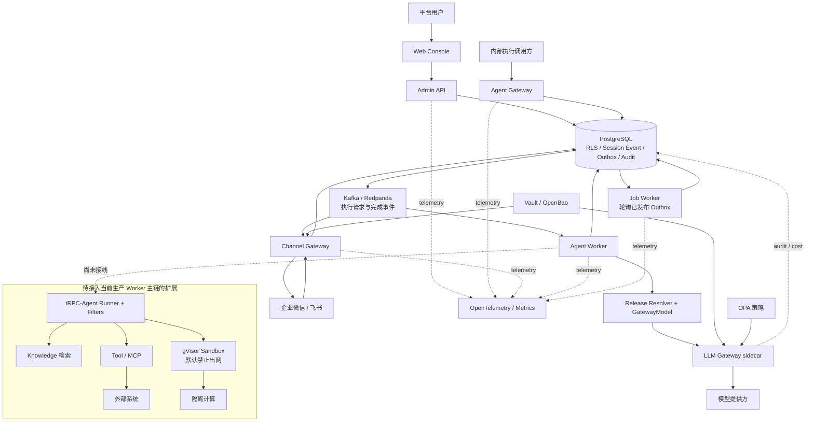
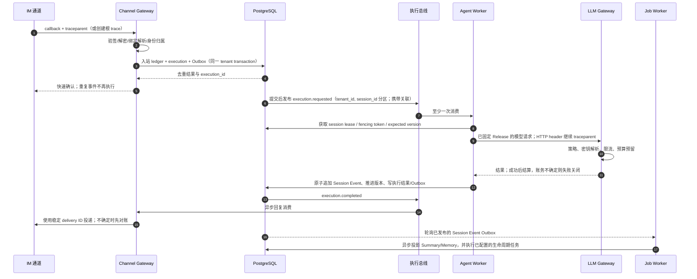

<!-- generated-by: gsd-doc-writer -->
# tRPC-Agent 多租户平台

面向企业私有化部署的多租户 Agent 平台：以 FastAPI 管理控制面、React 管理控制台和异步数据面，把 Agent 发布、IM 接入、工具治理、存储、预算及审计放在可追溯的边界内。

这份 README 只描述仓库代码、配置和测试可确认的事实。Docker Compose 是本地开发拓扑；Kubernetes/Helm/GitOps 是仓库提供的生产部署骨架，但不等于已在真实生产环境完成验收。

## 文档导航

- [开发与本地拓扑](docs/development.md)
- [架构设计](docs/architecture/architecture-design.md) 与 [架构图/IM 时序图](docs/architecture/system-diagrams.md)
- [数据模型、一致性和多后端](docs/architecture/data-model-and-sync.md)
- [Kubernetes 部署、金丝雀与回滚](docs/kubernetes.md)
- [备份与故障转移运行手册](docs/backup-failover-runbook.md)
- [风险登记与验收状态](docs/risk-register-and-acceptance.md)；[公开边界验收说明](docs/final-acceptance.md)
- [Admin API OpenAPI 契约](docs/contracts/admin-api.openapi.json) 与 [领域事件 Schema](docs/contracts/domain-events.schema.json)

验收所需的八项交付物链接：

- [架构设计文档](docs/architecture/architecture-design.md)
- [系统架构图](docs/architecture/system-diagrams.md) 与 [核心时序图](docs/architecture/system-diagrams.md)
- [数据模型设计](docs/architecture/data-model-and-sync.md)、[数据同步和幂等策略](docs/architecture/data-model-and-sync.md) 与 [多后端适配方案](docs/architecture/data-model-and-sync.md)
- [生产风险清单](docs/risk-register-and-acceptance.md) 与 [GitHub 实现代码](docs/final-acceptance.md)

## 架构与部署边界

控制面管理身份、租户、Agent Draft/Release/Deployment、模型与存储配置档、策略、预算、审批和审计；数据面接收执行或 IM 消息、持久化执行命令、运行已发布版本并异步交付回复。LLM Gateway 是 Agent Gateway Pod 内的 sidecar（端口 8001），不是第七个部署单元。



Helm 和 ApplicationSet 将下列六个单元作为独立 release；每个单元有独立的 production values，生产骨架中为它们配置了 ServiceAccount、Service、HPA、PDB、NetworkPolicy。Admin API 与 Web Console 是 Deployment；其余四个是 Argo Rollout。

| 单元 | 职责 | 生产骨架健康路径 | 代码/配置证据 |
|---|---|---|---|
| Admin API | 控制面 API、OIDC/RBAC、审批、管理审计 | `/api/v1/health` | `trpc_service/admin_api/` |
| Web Console | React/Vite 管理界面 | `/` | `web-console/` |
| Agent Gateway | 接收执行、Outbox 与总线提交、入口背压 | `/health/ready` | `trpc_service/agent_gateway.py` |
| Channel Gateway | 企业微信/飞书验签、入站幂等、异步回复 | `/health/ready` | `trpc_service/channel_gateway.py` |
| Agent Worker | 消费执行，固定 Release 运行、Session fencing | `/health/ready` | `trpc_service/agent_worker.py` |
| Job Worker | Summary/Memory 投影与保留清理；按配置启用 Artifact/内容删除，按工厂注入启用存储迁移 | `/health/ready` | `trpc_service/job_worker.py` |

## tRPC-Agent-Python 的当前使用边界

仓库将 `trpc-agent-py` 精确锁定为 `1.1.19`。Agent Gateway 的 Release-pinned runtime 会按已解析的 Release 构造 SDK 的 `LlmAgent`、`OpenAIModel`、`Runner` 和每个 Release 共享的 `InMemorySessionService`；HTTP、SSE、AG-UI 与 A2A 四类协议入口复用该 runtime。AG-UI 的 `AgUiAgent` 与 A2A 的 agent card/JSON-RPC 应用直接委托 SDK 的协议适配器，因而不是本项目自定义的协议实现。

`GovernedTool` 已实现为 SDK `BaseTool` 桥接，`SandboxedCodeExecutor` 已实现为 SDK `BaseCodeExecutor` 并将代码交给 gVisor sandbox；但当前 Agent Gateway 创建 production runtime 时没有注入 tool resolver/invoker 或 code executor。因此不得据此声称生产 Runner 已调用 Tool/MCP 或 sandbox。SDK 版本会被启动时守卫、健康响应与评测依赖快照记录，且每日上游检查通过 `scripts/check_upstream_release.py` 查询稳定候选版本。服务之间的实际传输仍是 HTTP、Kafka/Redpanda 兼容执行总线和 PostgreSQL 事务/Outbox；本仓库没有采用通用 tRPC RPC 作为服务间传输。

## 完整消息链路、关联与提交点



HTTP 服务安装遥测中间件后会接受有效的 W3C `traceparent`，否则创建根上下文，并将新的子 `traceparent` 写入响应；执行事件保存该上下文，异步 Worker 创建关联 Span，并把当前 `traceparent` 作为 HTTP header 传给 LLM Gateway，再写入完成事件。允许记录的 telemetry 属性受 allowlist 限制，正文与未允许 baggage 不应进入该链路。审计调用覆盖管理操作、发布/降级、预算、工具、内容生命周期等代码路径；审计链、manifest 和 WORM 资产在仓库中实现。对真实 OTLP 导出端、日志后端、审计保留和外部系统端到端 trace 的部署/验收，仍需环境证据。

## 核心难题如何处理

| 难题 | 当前解决机制 | 一致性或失败边界 |
|---|---|---|
| Worker 无状态，但 Agent 需要上下文 | Worker 不保存本地会话；PostgreSQL Session Event 是事实源，State/Summary/Memory 是带来源版本的投影。执行前获取短租约和单调 fencing token，提交时校验 `expected_version` | 失租或版本冲突拒绝提交；Memory/Summary 延迟不阻塞当前回复，可从 Session Event 重建 |
| IM 乱序、重复、超时、限长与身份映射 | Channel Binding 唯一解析租户与应用；入站 ledger 用稳定消息键和 payload hash 去重/隔离冲突；会话按租户和会话键分区；回复使用稳定 delivery ID、合并/分段和不确定结果对账 | 不承诺外部 IM exactly-once；重复投递复用原执行，键相同而正文不同则拒绝；回调先持久化后快速确认 |
| SQL、Redis、向量库和对象存储语义不同 | Storage Profile 分别声明四类后端；已实现的 SQL 路径使用事务、RLS 与 Outbox，缓存采用可丢弃/可重建语义，向量索引按 Revision 重建；对象存储目标采用不可变 key、摘要和生命周期策略；迁移状态机负责 backfill、catch-up、校验、切换和回滚 | 不做跨后端分布式事务；采用“SQL 权威事实 + 至少一次事件 + 业务幂等 + 校验对账”。当前 Artifact 仍存 SQL，真实 Redis/Vector/Object 客户端接线状态见下表 |
| 模型、工具、MCP、知识、沙箱和外部系统跨组件 | 当前生产主链已让 `traceparent` 贯穿执行事件、Worker、LLM Gateway HTTP 请求和完成事件；租户、执行、会话 ID 是受控属性；工具审批、MCP 注册、知识版本、沙箱资产和审计模块分别存在 | 当前 Kafka Worker 只解析并记录 Knowledge Revision ID，然后执行模型调用；Runner/Filters、真实知识检索、Tool/MCP 调用和 Sandbox 尚未接入这条生产主链，不能声称已有全链路 trace。正文和秘密不进入允许列表；Collector 与跨供应商 trace 仍需生产等价验证 |
| 灰度、回滚、限流、成本与合规 | 不可变 Release、环境 Deployment、生产四眼审批和评测门禁；Argo Rollout 分阶段放量；Gateway admission + HPA；模型调用先预算预留再结算；审计链、保留、Legal Hold 和可证明删除 | 应用回滚不撤销数据库迁移、已发送消息或外部工具副作用；这些对象必须走各自补偿、对账和审计流程 |

## 多租户隔离：不止 `tenant_id`

隔离根是 tenant。Tenant Group 当前只提供不继承权限的管理分组；成本、容量与 SLO 汇总仍是规划能力，不能把现有分组 API 当作已实现的聚合系统。现有设计与实现采用以下层次；任何一层的配置并不能单独证明隔离已经完成。

| 层次 | 仓库中的机制 | 边界与待验证项 |
|---|---|---|
| 配置与发布 | 租户拥有 Agent、Release、Deployment、模型/策略/存储配置档；Release 固定路由 | Development、Staging、Production 是发布与信任边界，不是 tenant 的替代物 |
| 授权/RBAC/RLS | OIDC 或会话认证、平台角色与租户成员关系；租户事务、复合键/外键及 PostgreSQL RLS 迁移 | 需要实际数据库角色、IdP 和权限审计的部署证据 |
| 密钥 | 模型与飞书配置保存引用，由 Gateway 使用 Kubernetes 身份访问 Vault/OpenBao 兼容服务 | 企业微信 callback 当前仍从全局 `WECOM_TOKEN`/`WECOM_ENCODING_AES_KEY` 读取，尚未实现按 binding/tenant 从 Vault 解析；真实 Vault 路径、轮换和审计也需环境证明 |
| 数据与存储 | Storage Profile 可选择共享命名空间或专属 SQL、Redis、Vector、Object 后端；高敏租户可指定专属 worker pool | 不承诺跨后端 exactly-once；实际后端、加密键和删除效果须演练 |
| 日志、Trace 与审计 | 属性 allowlist、身份/正文保护取向、审计事件/链/manifest | Collector、日志检索权限和敏感信息扫描需要生产等价验证 |
| Tool / Sandbox / MCP | 工具按副作用分级、审批与检查点；MCP Server 由租户路径注册；Helm 提供 gVisor、禁网与资源限制的 sandbox 资产 | 要在启用 RuntimeClass、策略和真实 MCP/工具端点的集群测试中验收 |
| 预算与成本 | LLM 调用在可计费请求前预留，成功后结算，失败释放；管理面有预算、价格、账本与告警 API | 供应商计量/账单对账和阈值配置仍是运营证据 |
| Worker 池与故障域 | Storage Profile 含 `worker_pool`；Worker 拒绝与自身池不匹配的租户；Helm 配置跨 zone spread、独立 HPA/PDB | 专属池实际容量、三故障域与跨地域隔离须通过集群/灾备演练证明 |

Session、Memory、Summary、工具上下文不保存在 Worker 本地：Worker 通过 PostgreSQL、存储配置档和事件投影读取/提交共享上下文。Session Event 是权威事实；Session State、Summary、Memory、缓存与索引是带来源版本的可重建投影。Agent Worker 持有短租约与单调 fencing token，并以 expected version 提交；失租或版本冲突会失败关闭。Memory/Summary 由 Job Worker 消费**已提交**事件后异步构建，因此当前回复不等待它们可见。

各后端的一致性语义是“至少一次传递 + 业务幂等”，而不是跨 PostgreSQL、Kafka、Redis、向量库、对象存储及 IM 平台的 exactly-once。入站键相同但 payload 摘要不同会被拒绝；消息、投递和工具结果不确定时进入保守恢复/对账路径，而不是盲目重试。

| 后端 | 权威性与同步策略 | 当前仓库实现状态 |
|---|---|---|
| PostgreSQL / SQL | 控制面、执行、Session Event、幂等 ledger、Outbox、审计和多数投影的权威事务；RLS、复合键和事务级 tenant context | 已由 `Database`、迁移和 PostgreSQL 集成测试真实接线 |
| Kafka / Redpanda | 执行主链使用已提交的 requested/completed 事件，并按 `(tenant_id, session_id)` 作为 Kafka key；通用 Outbox dispatcher 还会把其他 PENDING 记录按 `event_type` 发布到同名 topic；消费者手动提交位点，有限重试后先写 DLQ 再提交源位点 | `aiokafka` 生产/消费已接线，Helm 显式配置执行 request/result/DLQ topic；其他 event-type topic 的预创建/治理、生产 lag 告警与 DLQ 重放演练仍未完成 |
| Redis | 只应承载 cache-aside、限流或可重建短状态；失效时回源 SQL，不能成为 Session/Event 权威源 | Compose 提供 Redis，但 `RedisCacheAdapter` 当前仍使用进程内字典作为测试实现，尚未接入生产 Redis client |
| Vector | Knowledge Revision 固化来源；索引以 revision/version 发布，双写迁移后用召回率和摘要校验再切换 | Compose 使用 PGVector 镜像，但当前知识检索是 PostgreSQL 全文检索，通用 Vector Adapter 仍是内存测试替身 |
| Object Storage | 目标策略是不可变对象 key、内容摘要、租户前缀、保留/Legal Hold 和删除证明，SQL 保存索引与状态 | 当前 `DatabaseArtifactStore` 把 Artifact 内容直接写入 PostgreSQL `tenant.artifact.content`；Compose 虽提供 MinIO，通用 Object Adapter 尚未接入 MinIO/S3，不能据此声明生产对象存储闭环 |

## IM、工具、合规与运行控制

- 企业微信回调先验签、解密、规范化和持久化去重；飞书回调先校验绑定并通过密钥解析验证事件。Kafka 已配置时，Channel Gateway 异步等待 Worker 结果；直接 Runner 路径仅是 Kafka 未配置时的本地/测试 fallback。
- IM 身份在 Channel Binding 下映射到租户内 IM 主体；跨通道 Memory 只可由已验证的主体关联启用。通道回复有速率限制、合并策略和稳定 delivery ID；超时/结果未知先查询或进入对账，避免把“至少一次”误写成“只发送一次”。
- Agent Gateway 有持续速率、突发速率、最大 in-flight 的 admission 配置；实现会对 `RATE_EXCEEDED`/`INFLIGHT_SATURATED` 返回 429。每个租户的业务级限额、模型供应商限额与预算需要在发布配置和运营策略中落实。
- Agent Deployment 支持记录评测/金丝雀观测、审批和回滚；Helm Rollout 对四个数据面单位以 10% → 停顿/分析 → 50% 的步骤推广。服务回滚仅恢复镜像/流量，不回滚数据库迁移、已执行工具副作用或外部消息。
- Helm 提供 strict mTLS、默认拒绝网络、ServiceAccount 调用方/方法/路径约束、固定 digest、HPA/PDB、Canary 分析和 standby fencing 的声明资产；这些是可渲染与黑盒测试的目标，不能替代真实集群、真实 IM/IdP/Vault/模型端点或跨地域演练。

## HTTP 边界与调试端点

不要把内部路径暴露到公网。Helm 的授权策略只给健康探针、指定 ServiceAccount 与固定方法/路径放行；本地 Compose 只暴露 Admin API、Web Console 和 fake 依赖。下表盘点仓库当前注册的 HTTP 面，`<base>` 代表你在本地或经受控集群访问的地址，未假定部署域名。

### 本地 Compose 暴露面

| 地址/端口 | 协议 | 用途 |
|---|---|---|
| `http://localhost:4173/` | HTTP | Web Console |
| `http://localhost:8000/` | HTTP | Admin API、OpenAPI、Metrics |
| `postgresql://localhost:5432/trpc_platform` | PostgreSQL | 本地数据库调试；开发凭据只从 `compose.yml` 读取 |
| `redis://localhost:6379/0` | Redis | 本地 Redis；当前未接入生产 Storage Adapter |
| `localhost:19092` | Kafka | Redpanda Kafka listener，不是 HTTP 控制台 |
| `http://localhost:9000` | S3 API | MinIO S3 兼容接口 |
| `http://localhost:9001` | HTTP | MinIO 本地管理控制台 |
| `http://localhost:8181` | HTTP | OPA API |
| `http://localhost:8090` | HTTP | Fake LLM/IM 与场景控制接口 |

这些端口和 `compose.yml` 中的开发凭据只用于本机。生产环境应通过 NetworkPolicy、Istio AuthorizationPolicy、ServiceAccount 和 Vault/OpenBao 限制访问。

### 本机初始管理员与用户登记

启动 `compose.yml` 后打开 `http://localhost:4173/`，可使用下列**仅限本机开发**的初始管理员登录：

| 项目 | 值 |
|---|---|
| 用户名 | `emergency-admin` |
| 密码 | `correct-horse` |

登录页只在 `localhost` 或 `127.0.0.1` 显示“自动填入”按钮。该账号来自 `EMERGENCY_ADMIN_USERNAME` 与 `EMERGENCY_ADMIN_PASSWORD_HASH`，属于 break-glass 开发入口，不是可复制到生产的默认账号。生产部署必须生成新的 Argon2id 密码散列、从 Secret/Vault 注入，并开启安全 Cookie；不要把明文密码写入 Helm values、镜像或仓库。

普通用户不维护第二套本地密码：配置 OIDC 后，用户首次点击“使用企业账号登录”会按 `(issuer, subject)` 自动登记；平台管理员也可在“租户与成员”中提前录入 OIDC Issuer、Subject、邮箱和显示名称，并一次选择初始平台角色、加入的租户与租户角色。平台角色和租户角色相互独立；普通用户不能自行注册为平台管理员或自行加入租户，避免开放注册造成权限提升。

“通道接入”界面提供企微和飞书的分步配置：选择租户/平台、填写 Bot ID 或 App ID、绑定 Agent 与环境、填写租户专属 `vault://tenant/...#字段` 引用，然后启用或停用绑定。界面会按平台直接生成回调 URL 或 `FEISHU_LONG_CONNECTIONS` 声明，并列出需要准备的密钥字段。明文 App Secret、Token 和 EncodingAESKey 不会写入管理数据库或在列表中回显。

| 通道 | 控制台身份参数 | 密钥路径字段 | 运行方式与额外部署参数 |
|---|---|---|---|
| 企业微信智能机器人 | 回调事件中的 `aibotid` | `#token`、`#encoding-aes-key` | 加密 HTTPS 回调：`/internal/v1/wecom/callback/{tenant_id}/{aibotid}`。当前 Channel Gateway 运行时还需把这两项映射为 `WECOM_TOKEN` 与 `WECOM_ENCODING_AES_KEY` |
| 飞书企业自建应用 | 开放平台的 `App ID` | `#app-secret`、`#verification-token`、`#tenant-access-token` | 官方 SDK 长连接，无需公网回调；把非敏感声明 `[{"tenant_id":"...","app_id":"..."}]` 注入 `FEISHU_LONG_CONNECTIONS` |

保存绑定只表示控制面配置已经登记，不等于运行连接已验证成功。上线前仍要按界面右侧清单完成 IM 平台能力/事件权限、Vault/OpenBao 字段、部署变量和消息回环测试。

### 公共管理面（Admin API）

本 API 的完整请求/响应 Schema、状态码和所有逐路径操作以 [OpenAPI 契约](docs/contracts/admin-api.openapi.json) 为准。`GET /api/v1/health` 不需要认证；OIDC 登录、回调和 emergency session 是认证入口；`GET /api/v1/auth/session` 需要会话/Bearer；其余管理接口按实现要求会话/Bearer 与相应角色。具有写入语义的接口通常要求 `Idempotency-Key`，并发更新接口还要求 `If-Match`；请以 OpenAPI 的参数定义为准。

下表的业务资源路径省略共同前缀 `/api/v1`；“调试文档”一行列的是绝对路径。`/internal/v1/degradations` 也以绝对路径注册，不使用 `/api/v1` 前缀。

| 资源族/前缀 | 已定义方法与路径 | 用途 |
|---|---|---|
| 调试文档 | `GET /api/docs`；`GET /redoc`；`GET /api/openapi.json`；`GET /docs/oauth2-redirect` | Swagger UI、ReDoc、机器可读契约及文档 OAuth 回调 |
| 健康与认证 | `GET /health`；`POST /auth/emergency/session`；`GET /auth/oidc/login`、`/auth/oidc/callback`；`GET`、`DELETE /auth/session` | 健康检查、OIDC/应急会话与注销 |
| 平台身份与租户 | `GET`、`POST /tenants`；`GET`、`POST /tenant-groups`；`GET`、`POST /platform-users`；`PUT /platform-users/{user_id}/roles/{role}`；`GET /tenants/{tenant_id}/members`；`PUT /tenants/{tenant_id}/members/{user_id}/roles/{role}` | 租户、组、平台用户、平台角色与租户成员角色 |
| Agent 生命周期 | `GET`、`POST /tenants/{tenant_id}/agent-applications`；`GET`、`PATCH`、`DELETE /.../{application_id}`；`GET`、`PUT`、`PATCH`、`DELETE /.../draft`；`POST /.../draft/validate`；`GET`、`POST /.../releases`；`GET`、`POST /.../deployments`；`POST /.../deployments/{deployment_id}/approve`、`/rollback`、`/eval-canary-observations` | Draft、不可变 Release、评测与环境发布 |
| 模型、策略、工具与审批 | `GET`、`POST /tenants/{tenant_id}/model-profiles`；`GET`、`PATCH`、`DELETE /.../model-profiles/{alias}`；`PUT /.../model-prices`、`/policy-bundles`、`/mcp-servers`、`/tools`；`GET /.../policy-bundles`、`/.../{version}/verification`、`/.../tools`；`GET /.../tool-approvals`、`/tool-call-reconciliation`；`POST /.../tool-approvals/{approval_id}/decisions`、`/tool-call-reconciliation/{call_id}/resolutions` | 模型、OPA 策略包、MCP、工具登记、人工审批与不确定结果对账 |
| 预算 | `PUT`、`GET /tenants/{tenant_id}/budgets`；`POST /.../budgets/{budget_id}/adjustments`；`GET /.../cost-ledger`、`/budget-alerts` | 预算、价格、成本账本与告警 |
| 存储与数据生命周期 | `GET`、`POST /tenants/{tenant_id}/storage-profiles`；`GET /.../storage-profiles/active`；`GET`、`POST /.../storage-migrations`；`GET /.../storage-migrations/{migration_id}`；`POST /.../{migration_id}/start`、`/advance`、`/approvals`、`/rollback`、`/rollback-approvals`；`GET`、`PUT /.../retention-policy`；`POST /.../retention-policy/{change_id}/approve`、`/legal-holds`、`/legal-holds/{hold_id}/approve`、`/release`、`/deletion-requests`；`GET /.../deletion-requests/{request_id}` | 存储配置/迁移、保留、legal hold 与删除请求 |
| Knowledge、通道与主体 | `GET`、`POST /tenants/{tenant_id}/knowledge-bases`；`POST /.../{base_id}/revisions`、`/deployments`、`/deployments/rollback`；`PUT /.../channel-bindings`、`/im-subject-associations`；`GET /.../channel-bindings`、`/channel-bindings/resolve`；`POST /.../channel-bindings/{binding_id}/status-changes`；`DELETE /.../im-subject-associations` | 知识版本、通道绑定、IM 主体关联/撤销 |
| 审计与运营查询 | `GET /audit-events`、`/tenants/{tenant_id}/audit-events`、`/ops/sessions`、`/ops/memories`、`/ops/artifacts`、`/ops/operations`、`/ops/dead-letters`；`POST /.../audit-events/{event_id}/corrections`、`/audit-manifests`、`/ops/dead-letters/{delivery_id}/retries`；`GET /.../audit-manifests/verification` | 平台/租户审计、manifest 校验、会话/Memory/Artifact/操作与 DLQ 运维 |
| 评测 | `POST /tenants/{tenant_id}/agent-applications/{application_id}/eval-suites`、`/eval-runs` | Release/Deployment 的评测资产与运行 |

`/policy-bundles` 路由只有在 `POLICY_SIGNING_KEY` 非空时才注册；调试时若该资源族没有出现在 `/api/openapi.json`，先检查此配置，而不是绕过签名校验。

安全的本地健康检查（不需要账号或凭据）：

```bash
curl --fail --silent --show-error http://localhost:8000/api/v1/health
curl --fail --silent --show-error http://localhost:8000/api/openapi.json >/dev/null
```

### 内部服务与运行调试面

这些路径应只通过受控服务身份、网格策略或临时 `kubectl port-forward` 调试。多数不属于 Admin API 公共契约，但 `/internal/v1/degradations` 已包含在 Admin OpenAPI；各 FastAPI 数据面服务也会生成自己的 OpenAPI/文档，不能把“可生成 Schema”理解为“允许公网访问”。除明确列出的 header 外，内部调用的身份/租户凭证依赖部署的零信任策略；仓库不提供可安全复用的公网 curl 或凭据。

| 服务 | 方法与路径 | 需要的鉴别/header | 用途 |
|---|---|---|---|
| Agent Gateway | `POST /internal/v1/agent-executions` | 内部调用方；JSON 含 tenant/application/environment/session/messages；可带 `trace_parent` | 创建/去重执行并写 Outbox，返回 202 或去重 200 |
| Agent Gateway | `GET /internal/v1/capacity` | 内部运维网络 | admission 阈值、在途/Outbox 数与 shed level |
| Agent Gateway / Runner | `POST /internal/v1/agent-runner/completions`、`/stream`；`GET /internal/v1/agent-runner/statuses/{execution_id}` | tenant/application/environment/session/user/message；受控集成调试 | 同一 Release-pinned Runner 的同步、SSE 与执行状态接口 |
| Agent Gateway / AG-UI | `POST /internal/v1/agent-runner/ag-ui/{tenant_id}/{release_id}` | AG-UI `RunAgentInput` | 委托 tRPC-Agent SDK 的 AG-UI 流式协议 |
| Agent Gateway / A2A | `GET /internal/v1/agent-runner/a2a/{tenant_id}/{release_id}/.well-known/agent-card.json`；`POST /internal/v1/agent-runner/a2a/{tenant_id}/{release_id}` | A2A agent card / JSON-RPC 请求 | 委托 tRPC-Agent SDK 的 A2A 协议 |
| Agent Worker | `POST /internal/v1/agent-executions`；`POST /internal/v1/deployment-executions` | 内部调用方及执行 payload | 直接运行已固定 Release 或部署路由，适合受控集成测试 |
| LLM Gateway sidecar | `POST /internal/v1/llm-completions` | Agent Worker 内部调用；release/tenant payload | 策略、密钥、模型、预算和 provider 调用 |
| Channel Gateway | `GET /internal/v1/artifacts/{artifact_id}` | `X-Artifact-Tenant`、`X-Artifact-Subject`、`X-Artifact-Access-Token` | Artifact 下载；缺任一凭据不可访问 |
| Job Worker | `GET /internal/v1/projection-metrics` | `X-Job-Worker-Operator-Token` | Session 投影指标 |
| Job Worker | `POST /internal/v1/tenants/{tenant_id}/memories/{memory_id}/corrections` | 同上；JSON 包含 actor/reason | 使指定 Memory 失效以触发受控修正 |
| Admin API、Agent Gateway、Agent Worker、Channel Gateway、Job Worker | `GET /internal/v1/degradations` | 内部运维网络 | 已登记的降级状态 |
| Admin API、Agent Gateway、Agent Worker、Channel Gateway、Job Worker | `GET /metrics` | 受控 Prometheus 抓取网络 | Prometheus 指标；LLM Gateway 未在其 app 中安装该路由 |
| Job Worker | `GET /docs`、`GET /docs/oauth2-redirect`、`GET /redoc`、`GET /openapi.json` | 仅受控调试网络 | FastAPI 默认交互文档与服务自身 Schema；其他四个 Python 数据面 app 在代码中显式关闭这些默认路由 |

### IM 回调面

这两个回调都在 Channel Gateway 的 `/internal/v1` 命名下，但它们是由已配置通道经受控入口访问的外部回调面，不能当成普通内部 API。不要用虚构的 `tenant_id`、`bot_id`、签名、token 或生产 URL 组成 curl。

| 通道 | 方法与路径 | 验证/限制 | 作用 |
|---|---|---|---|
| 企业微信 | `GET /internal/v1/wecom/callback/{tenant_id}/{bot_id}` | query 必须含 `msg_signature`、`timestamp`、`nonce`、`echostr`；服务使用回调 token/AES key 验签解密 | 平台回调验证 |
| 企业微信 | `POST /internal/v1/wecom/callback/{tenant_id}/{bot_id}` | 同上；JSON body 的 `encrypt` 必须通过验证 | 接收文本事件、写入入站 ledger；撤回/重复事件不执行 |
| 飞书 | `POST /internal/v1/feishu/callback/{tenant_id}/{bot_id}` | body 经绑定和 Vault 解析的验证 token 校验；standby 时拒绝 | 接收飞书事件并进入同一入站/执行链路 |

### 健康检查面

| 服务 | 路径 | 本地 Compose 是否直接可用 |
|---|---|---|
| Admin API | `GET /api/v1/health` | 是，映射到 `localhost:8000` |
| Agent Gateway、Agent Worker、Channel Gateway、LLM Gateway | `GET /health/live`、`GET /health/ready` | 代码/Helm 有定义；Compose 不启动这些单元 |
| Job Worker | `GET /health/live`、`GET /health/ready` | 代码/Helm 有定义；Compose 不启动该单元 |
| Fake external | `GET /health` | 是，映射到 `localhost:8090` |

### 仅本地/测试的 Fake 外部依赖

`dev/fake_external/server.py` 是可编程 LLM/IM 替身，由 Compose 的 `fake-external` 服务启动；绝不可部署为真实模型或 IM 服务。

| 方法 | 路径 | 用途 | 安全示例 |
|---|---|---|---|
| `GET` | `/health` | 存活状态 | `curl --fail http://localhost:8090/health` |
| `GET` | `/control/v1/scenarios` | 查看当前 fake 场景 | `curl --fail http://localhost:8090/control/v1/scenarios` |
| `POST` | `/control/v1/scenarios` | 设置 LLM/IM 的 `success`、`duplicate`、`out_of_order`、`rate_limit`、`timeout`、`disconnect` 或 `outcome_unknown` 场景 | `curl -X POST http://localhost:8090/control/v1/scenarios -H 'Content-Type: application/json' -d '{"llm":"timeout","im":"duplicate"}'` |
| `POST` | `/control/v1/reset` | 恢复默认场景并清空已接收消息 | `curl -X POST http://localhost:8090/control/v1/reset` |
| `POST` | `/llm/v1/chat/completions` | OpenAI 形状的确定性 LLM 替身（含 stream） | 由集成测试/受控客户端调用 |
| `GET`、`POST` | `/im/v1/messages` | 查看 fake 投递或模拟 IM 发送 | `curl --fail http://localhost:8090/im/v1/messages` |

## 本地安装、运行与验证

前置条件由仓库锁定/文档确认：Python **3.12**（`pyproject.toml` 要求 `==3.12.*`）、uv、Node.js 22.22.2、npm、Docker 和 Docker Compose。不要将 Compose 中的开发密码、服务地址或 fake 行为复制到生产配置。

```bash
# 同步 Python 依赖、安装 Web 依赖、构建前端与 Compose 镜像
./build.sh

# 启动并等待本地依赖、迁移、Admin API、Web Console
./start.sh

# 停止；若需删除本地卷与构建缓存，请阅读 clean.sh 后运行 ./clean.sh
./stop.sh
```

启动成功后，Web Console 位于 `http://localhost:4173`，Admin API 健康端点位于 `http://localhost:8000/api/v1/health`。本地 Compose 会启动 PostgreSQL/PGVector、Redis、Redpanda、MinIO、OPA、fake-external、迁移、Admin API 和 Web Console；它不会启动六单元生产拓扑中的 Agent/Channel/Job Worker、服务网格、gVisor 或灾备。

常用验证命令：

```bash
# Python 单元测试和完整本地质量检查
uv run pytest tests/unit
uv run pytest tests/unit tests/integration \
  --cov=trpc_service --cov=dev.fake_external.scenarios --cov-branch --cov-fail-under=80 -q

# Web Console
npm test --prefix web-console
npm run typecheck --prefix web-console
npm run test:smoke --prefix web-console

# 格式化/静态检查（会修改文件）
./format.sh

# 覆盖率报告（会产生 htmlcov 和 Web 覆盖率目录）
./coverage.sh

# 重新导出并生成 Admin API TypeScript 客户端
uv run python scripts/export_openapi.py
npm run generate:api --prefix web-console
```

## 生产部署与证据边界

先阅读 [Kubernetes 指南](docs/kubernetes.md)，再在受控环境执行下列仓库命令。Helm 默认镜像 digest 是不可部署的全零占位符；生产前必须通过已评审、已扫描和已签名的真实 digest 更新 values。也不要把仓库内 Vault 地址、角色名或任何本地 Compose 配置视为生产凭据。

```bash
scripts/install_kubernetes_tools.sh /tmp/trpc-platform-tools
export PATH="/tmp/trpc-platform-tools:${PATH}"

helm lint deploy/helm/trpc-agent-platform
helm template platform deploy/helm/trpc-agent-platform >/tmp/trpc-platform-rendered.yaml
uv run pytest tests/deployment/test_helm_contract.py tests/deployment/test_zero_trust_contract.py

# 在 disposable Kind 环境验证 Helm/GitOps/网格/金丝雀边界
RUN_KUBERNETES_SMOKE=1 uv run pytest tests/deployment/test_kubernetes_smoke.py -v -s
```

生产 GitOps 入口是 `deploy/gitops/production/project.yaml` 与 `deploy/gitops/production/applicationset.yaml`；部署前还须完成真实 IdP、IM、Kafka/Redis/对象存储、Vault、模型端点、观测导出、备份恢复与跨地域 fencing 的环境演练。风险登记中的生产风险仍有 `OPEN` 项，仓库测试或文档存在不能把它们标为已关闭；请以 [风险登记](docs/risk-register-and-acceptance.md) 和 [最终验收说明](docs/final-acceptance.md) 中绑定版本、环境和运行记录的证据为准。
