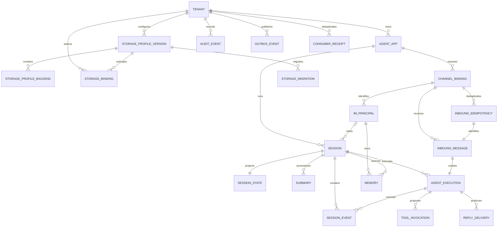

# 数据模型、同步幂等与多后端设计

> 本文冻结数据库、Kafka 契约、Storage Adapter 和在线迁移共同使用的设计基线。总体边界见[总体架构设计](architecture-design.md)，名词以 [`CONTEXT.md`](../../CONTEXT.md) 为准，冲突时以 [Accepted ADR](../adr/README.md) 为准。事件的机器可读契约见 [`domain-events.schema.json`](../contracts/domain-events.schema.json)。

## 1. 设计约束

1. PostgreSQL 是控制面、Session Event、幂等账本、执行状态、Outbox 和迁移控制状态的事务权威；Kafka 只传递已提交事实或命令，不是 Session Event 的权威副本。
2. 所有内部 ID 由应用生成 UUIDv7。除平台全局表外，租户逻辑实体都包含 `tenant_id`，由实体表或不分区 identity ledger 强制 `UNIQUE (tenant_id, id)`；租户内关系使用包含 `tenant_id` 的复合外键。时间分区 record 的主键额外包含分区时间列。
3. Session Event 不可变；Session State、Summary、Memory 向量、缓存和检索索引都是带来源版本、可重建或可重新投影的数据。
4. 交付语义是“至少一次传递 + 业务幂等”，不宣称跨 PostgreSQL、Kafka、Redis、向量库、对象存储或 IM 平台的 Exactly Once。
5. 数据正文与元数据分离。数据库和事件默认只保存必要字段、摘要与对象引用；密钥只保存 Vault 兼容的密钥引用。
6. Storage Adapter 是 Worker 使用的进程内库。每个租户通过不可变版本的存储配置档选择共享命名空间或专属后端，不增加独立存储微服务。

## 2. 核心关系



`Tenant Group`、Agent Draft/Release/Deployment、Knowledge、预算和审批等实体继续遵守同一租户键规则，但不是本工单同步链路的最小关系集。`tenant` 是平台边界根，因此它位于平台全局 Schema，主键只有 `id`；其他业务表位于租户 Schema。

## 3. 关系模型与数据字典

通用列未在每行重复：逻辑租户实体均有 `tenant_id uuid NOT NULL`、`id uuid NOT NULL`、`created_at timestamptz NOT NULL DEFAULT transaction_timestamp()`；可修改记录另有 `updated_at timestamptz NOT NULL DEFAULT transaction_timestamp()` 和 `version bigint NOT NULL DEFAULT 1 CHECK (version > 0)`。ID 由应用生成 UUIDv7，时间统一保存 UTC。枚举使用带 `CHECK` 的 `text`，避免 PostgreSQL Enum 阻塞滚动升级。

数据字典采用以下固定规则，避免迁移实现自行猜测：

- 表中列出的字段默认 `NOT NULL`；只有本节“可空字段”明确列出的字段允许 `NULL`。业务状态、主体和引用不设置隐式默认值，写入方必须显式给值。
- `*_id` 为 `uuid`；`*_at`、`*_until`、`*_expires_at` 和 `*_deadline` 为 `timestamptz`；版本、序号、次数、游标计数和费用整数为 `bigint`；`latency_ms` 为非负 `integer`。
- `*_digest` 为带 `sha256:` 前缀的 `varchar(71)`；不可逆身份/账号 `*_hash` 为 SHA-256 `bytea`（32 bytes）；`*_ref` 为不含凭据的 `text`；`idempotency_key` 为 `varchar(200)`；`trace_id` 为 16 bytes；`currency` 为 ISO 4217 `char(3)`。
- `payload`、`state`、`capabilities`、`reply_policy` 为 `jsonb`；`degraded_capabilities` 为 `text[] NOT NULL DEFAULT '{}'`；正文密文使用 `bytea`，大正文使用对象引用。
- 无后缀标量 `slug`、`name`、`profile_key`、`channel_type`、`status`、`event_type`、`data_classification`、`generator_version`、`strategy_version`、`tool_version`、`side_effect_class`、`error_code`、`aggregate_type`、`schema_uri`、`partition_key`、`consumer_name`、`actor_type`、`action`、`decision`、`target_type`、`phase`、`shard_key`、`data_domain`、`state` 和迁移游标均为受长度约束的 `text`。`revision`、`key_version`、`generation`、`expected_session_version`、`lease_fence`、范围版本、`turn_no`、`ordinal`、`logical_part`、`attempt_no`、`publish_attempts`、`copied_count`、`verified_count` 为 `bigint`。
- 计数默认 `0`：`current_version`、`current_fence`、`publish_attempts`、`logical_part`、`cost_minor`；`attempt_no`、`sequence_no` 从 `1` 开始。所有金额以最小货币单位保存。
- 可空字段只有：`im_principal.display_name_ciphertext`；群聊 `session.im_principal_id`；尚未产生或过期删除后的内容/对象/向量引用；尚未发生的 `tombstoned_at`；未开始/结束的执行时间和 `error_code`；未完成投递的外部消息哈希、完成时间、错误与重试时间；未审批调用的 `approval_request_id`；无前序投递的 `ordered_after_delivery_id`；未发布 `published_at`；Consumer 未成功时的 `processed_at` 和 `result_ref`；未发生迁移阶段的游标、时间与错误；无关联对象的审计外键、错误和费用字段。可空引用仍须在非空时通过复合外键。

状态列只允许下列值；增加值须先按 Expand-Migrate-Contract 让旧版本安全忽略或显式拒绝，再更新约束：

| 状态列 | 允许值 |
|---|---|
| `tenant.status` | `ACTIVE`, `SUSPENDED`, `DELETING`, `DELETED` |
| `agent_app.status` | `ACTIVE`, `DISABLED`, `DELETED` |
| `storage_profile_version.status` | `VALIDATING`, `PUBLISHED`, `RETIRED` |
| `channel_binding.status` | `ACTIVE`, `DISABLED`, `REVOKED` |
| `im_principal.status` | `ACTIVE`, `BLOCKED`, `DELETED` |
| `session.status` | `ACTIVE`, `CLOSED`, `DELETING`, `DELETED` |
| `agent_execution.status` | `RECEIVED`, `QUEUED`, `RUNNING`, `WAITING_APPROVAL`, `COMMITTED`, `FAILED`, `CANCELLED` |
| `summary.status` | `PENDING`, `READY`, `FAILED`, `DELETED` |
| `memory.status` | `PENDING`, `READY`, `FAILED`, `DELETING`, `DELETED` |
| `tool_invocation.status` | `PROPOSED`, `WAITING_APPROVAL`, `APPROVED`, `REJECTED`, `RUNNING`, `SUCCEEDED`, `FAILED`, `OUTCOME_UNKNOWN`, `CANCELLED` |
| `reply_delivery.status` | `PENDING`, `SENDING`, `DELIVERED`, `RETRYABLE`, `OUTCOME_UNKNOWN`, `DEAD_LETTER`, `CANCELLED` |
| `reply_delivery_attempt.status` | `PENDING`, `SENDING`, `SENT`, `CONFIRMED`, `FAILED`, `OUTCOME_UNKNOWN` |
| `consumer_receipt.status` | `PROCESSING`, `SUCCEEDED`, `RETRYABLE_FAILED`, `TERMINAL_FAILED` |
| `storage_migration.state` | `PREPARING`, `BACKFILLING`, `CATCHING_UP`, `VALIDATING`, `READY_TO_CUTOVER`, `CUTTING_OVER`, `OBSERVING`, `COMPLETED`, `FAILED`, `ROLLING_BACK`, `ROLLED_BACK` |
| `environment` | `DEVELOPMENT`, `STAGING`, `PRODUCTION` |
| `data_domain` | `SESSION`, `MEMORY`, `VECTOR`, `OBJECT`, `AUDIT` |
| `backend_kind` | `SQL`, `REDIS`, `VECTOR`, `OBJECT`, `EXTERNAL_MEMORY` |
| `data_classification` | `PUBLIC`, `INTERNAL`, `CONFIDENTIAL`, `RESTRICTED` |
| `side_effect_class` | `READ_ONLY`, `IDEMPOTENT_WRITE`, `NON_IDEMPOTENT_WRITE`, `HIGH_RISK` |
| `storage_migration_checkpoint.phase` | `BACKFILL`, `CATCH_UP`, `VALIDATE` |

### 3.1 配置、通道与身份

| 表 | 关键字段 | 约束与用途 |
|---|---|---|
| `platform.tenant` | `id`, `slug`, `status`, `data_classification`, `encryption_key_ref`, `retention_policy_id` | `id` 主键；`slug` 全局唯一；不保存密钥正文。租户停用只阻止新执行，不绕过保留和删除流程。 |
| `tenant.agent_app` | `name text`, `status text` | `UNIQUE (tenant_id, id)`；名称在未删除记录中租户内唯一。所有 Session、通道绑定和执行通过复合外键归属同一租户。 |
| `tenant.storage_profile_version` | `profile_key`, `revision`, `status`, `config_digest` | `UNIQUE (tenant_id, profile_key, revision)`、`UNIQUE (tenant_id, id)`；发布后不可变；摘要覆盖完整后端映射。 |
| `tenant.storage_profile_backend` | `profile_version_id`, `data_domain`, `backend_kind`, `config_ref`, `capabilities jsonb` | `UNIQUE (tenant_id, profile_version_id, data_domain, backend_kind)`；一个域可同时声明 SQL 权威与 Redis 缓存/租约。只为实际启用的后端建行，`config_ref` 只含 Endpoint/密钥引用；未选外部 Memory 时不存在对应行。 |
| `tenant.storage_binding` | `environment text`, `data_domain text`, `active_profile_version_id uuid`, `binding_version bigint` | `UNIQUE (tenant_id, environment, data_domain)`；复合外键指向已发布配置版本；迁移切换只原子移动此指针并递增版本，不修改 Agent App。 |
| `tenant.channel_binding` | `agent_app_id`, `channel_type`, `external_account_hash`, `credential_ref`, `callback_key_hash`, `status`, `reply_policy jsonb` | 外键 `(tenant_id, agent_app_id)`；有效记录上 `UNIQUE (tenant_id, channel_type, external_account_hash)`；原始外部账号和 Token 不入索引或日志。 |
| `tenant.im_principal` | `channel_binding_id`, `external_user_hash`, `display_name_ciphertext`, `status` | 外键 `(tenant_id, channel_binding_id)`；`UNIQUE (tenant_id, channel_binding_id, external_user_hash)`；相同外部用户出现在另一绑定时仍是不同主体。 |

### 3.2 入站、执行与 Session

| 表 | 关键字段 | 约束与用途 |
|---|---|---|
| `tenant.inbound_idempotency` | `channel_binding_id`, `idempotency_key`, `key_version`, `payload_digest`, `inbound_message_id`, `execution_id`, `received_at`, `expires_at`, `tombstoned_at` | 不分区的持久 ledger；`UNIQUE (tenant_id, channel_binding_id, idempotency_key)`。相同键必须具有相同摘要；以延迟复合外键关联预生成的消息/执行 ID，正文删除后仍保留引用和墓碑。 |
| `tenant.inbound_message` | `channel_binding_id`, `im_principal_id`, `payload_digest`, `payload_object_ref`, `received_at`, `content_expires_at`, `tombstoned_at` | 复合外键指向通道和主体；唯一入站身份及其原执行映射由 ledger 保证，Payload 使用租户密钥加密。 |
| `tenant.session` | `agent_app_id`, `im_principal_id`, `session_key_hash`, `generation`, `status`, `current_version`, `current_fence`, `last_active_at`, `content_expires_at` | `UNIQUE (tenant_id, agent_app_id, session_key_hash, generation)`；复合外键指向 Agent App 与可选 IM 主体；`current_version >= 0`、`current_fence >= 0`。群聊 Session 的主体为空，稳定 chat/thread 标识只参与哈希。 |
| `tenant.agent_execution` | `session_id`, `inbound_message_id`, `agent_release_id`, `trace_id`, `status`, `expected_session_version`, `lease_fence`, `started_at`, `finished_at`, `error_code`, `degraded_capabilities text[]` | `UNIQUE (tenant_id, inbound_message_id)` 保证一条入站只创建一次执行；外键 `(tenant_id, session_id)`；状态机消费 Kafka 重投时只前进不倒退。 |
| `tenant.session_event_identity` | `session_id uuid`, `sequence_no bigint`, `idempotency_key varchar(200)`, `occurred_at timestamptz`, `payload_digest varchar(71)` | 不分区的紧凑 identity ledger；`UNIQUE (tenant_id, id)`、`UNIQUE (tenant_id, id, occurred_at)`、`UNIQUE (tenant_id, session_id, sequence_no)`、`UNIQUE (tenant_id, session_id, idempotency_key)`。它固定一个 ID 唯一允许的分区时间并保留墓碑摘要。 |
| `tenant.session_event` | `id uuid`, `session_id uuid`, `execution_id uuid`, `sequence_no bigint`, `event_type text`, `schema_version bigint`, `idempotency_key varchar(200)`, `occurred_at timestamptz`, `data_classification text`, `payload jsonb`, `payload_digest varchar(71)`, `content_expires_at timestamptz` | 逻辑 Session Event 的权威事实；按 `occurred_at` 月分区，主键 `(tenant_id, id, occurred_at)`；三元外键 `(tenant_id, id, occurred_at)` 指向 identity 的同名唯一键，因此同一 ID 不能落入另一分区。只允许 `INSERT`，与 identity 同事务写入。 |
| `tenant.session_state` | `session_id`, `source_version`, `state jsonb`, `state_digest`, `updated_at` | 保留通用主键 `(tenant_id, id)`，另以 `UNIQUE (tenant_id, session_id)` 保证一对一；只能从版本 `source_version` 的已提交事件重建；更新与 Session Event 追加同事务完成。 |
| `tenant.summary` | `session_id`, `source_from_version`, `source_to_version`, `generator_version`, `content_ciphertext`, `content_digest`, `status` | `UNIQUE (tenant_id, session_id, source_from_version, source_to_version, generator_version)`；只覆盖确定事件范围；旧任务不得覆盖更新的 `source_to_version`。 |

### 3.3 Memory、工具与回复

| 表 | 关键字段 | 约束与用途 |
|---|---|---|
| `tenant.memory` | `im_principal_id`, `source_session_id`, `source_from_sequence`, `source_to_sequence`, `strategy_version`, `content_object_ref`, `content_digest`, `vector_ref`, `status`, `last_verified_at`, `expires_at` | 来源复合外键指向主体与 Session；`UNIQUE (tenant_id, im_principal_id, source_session_id, source_from_sequence, source_to_sequence, strategy_version)` 是提取幂等键。只有 `READY` 对读取可见。 |
| `tenant.tool_invocation` | `execution_id`, `session_id`, `tool_id`, `tool_version`, `turn_no`, `ordinal`, `side_effect_class`, `arguments_digest`, `idempotency_key`, `approval_request_id`, `status`, `result_digest`, `error_code` | `UNIQUE (tenant_id, execution_id, turn_no, ordinal)`、`UNIQUE (tenant_id, idempotency_key)`；参数正文按分级加密或存对象，不进入审计。`OUTCOME_UNKNOWN` 是终止自动重试的明确状态。 |
| `tenant.reply_delivery` | `execution_id`, `channel_binding_id`, `delivery_id`, `logical_part`, `content_digest`, `content_object_ref`, `status`, `ordered_after_delivery_id`, `next_attempt_at` | `UNIQUE (tenant_id, delivery_id)`、`UNIQUE (tenant_id, execution_id, logical_part)`；一个逻辑回复的 `delivery_id` 永不变化。 |
| `tenant.reply_delivery_attempt` | `delivery_id`, `attempt_no`, `attempt_id`, `external_message_id_hash`, `status`, `started_at`, `finished_at`, `error_code`, `provider_retry_at` | 外键 `(tenant_id, delivery_id)`；`UNIQUE (tenant_id, delivery_id, attempt_no)`、`UNIQUE (tenant_id, attempt_id)`；每次网络发送均单独记录。 |

### 3.4 可靠传递、审计与迁移

| 表 | 关键字段 | 约束与用途 |
|---|---|---|
| `tenant.outbox_event_identity` | `created_at`, `payload_digest` | 不分区紧凑 identity；`UNIQUE (tenant_id, id)` 与 `UNIQUE (tenant_id, id, created_at)` 固定 CloudEvent ID 和分区时间。 |
| `tenant.outbox_event` | `id`, `aggregate_type`, `aggregate_id`, `event_type`, `schema_uri`, `payload jsonb`, `payload_digest`, `partition_key`, `traceparent`, `available_at`, `published_at`, `publish_attempts` | 与业务变更及 identity 同事务插入，按 `created_at` 周分区；主键及三元外键使用 `(tenant_id, id, created_at)`。`id` 同时是 CloudEvent `id`；发布成功前不可删除。 |
| `tenant.consumer_receipt` | `consumer_name`, `event_id`, `payload_digest`, `status`, `processed_at`, `result_ref` | `UNIQUE (tenant_id, consumer_name, event_id)`；成功重投返回原结果，可重试失败用版本 CAS 重新取得处理权；相同事件 ID 摘要不同必须拒绝并告警。 |
| `tenant.audit_event_identity` | `occurred_at`, `previous_hash`, `event_hash` | 不分区；`UNIQUE (tenant_id, id)` 与 `UNIQUE (tenant_id, id, occurred_at)` 固定 ID、分区时间和哈希链位置。 |
| `tenant.audit_event` | `id`, `occurred_at`, `actor_type`, `actor_id_hash`, `action`, `decision`, `target_type`, `target_id`, `session_id`, `agent_app_id`, `tool_invocation_id`, `channel_type`, `latency_ms`, `error_type`, `cost_minor`, `currency`, `trace_id`, `manifest_ref`, `correction_of_id` | 只追加并按月分区，主键及三元外键使用 `(tenant_id, id, occurred_at)`；正文、秘密、原始 IM 身份和工具参数默认不记录。查询和导出本身也生成审计事件。 |
| `tenant.storage_migration` | `storage_binding_id`, `profile_key`, `source_profile_version_id`, `target_profile_version_id`, `data_domain`, `state`, `snapshot_cursor`, `change_cursor`, `validated_at`, `cutover_at`, `observe_until`, `rollback_deadline`, `error_code` | 复合外键指向 Storage Binding 和两个配置版本；同一 `(tenant_id, storage_binding_id)` 最多一个未终结迁移；源、目标版本不可相同；每次状态变化写 Audit Outbox。 |
| `tenant.storage_migration_checkpoint` | `migration_id`, `shard_key`, `phase`, `cursor`, `copied_count`, `verified_count`, `source_digest`, `target_digest`, `updated_at` | `UNIQUE (tenant_id, migration_id, shard_key, phase)`；Job Worker 以此断点续跑，不能以进程内计数判断完成。 |

`agent_release_id`、`tool_id`、`approval_request_id` 等字段在对应领域表落地时同样使用 `(tenant_id, id)` 复合外键。为保持图可读，未把所有外围实体展开。

## 4. PostgreSQL 隔离与约束模板

下列模板是所有租户表的实现要求，不是仅供 Repository 自觉遵守的约定：

```sql
CREATE TABLE tenant.session_event_identity (
    tenant_id uuid NOT NULL,
    id uuid NOT NULL,
    session_id uuid NOT NULL,
    sequence_no bigint NOT NULL CHECK (sequence_no > 0),
    idempotency_key varchar(200) NOT NULL,
    occurred_at timestamptz NOT NULL,
    payload_digest varchar(71) NOT NULL CHECK (
        payload_digest ~ '^sha256:[0-9a-f]{64}$'
    ),
    created_at timestamptz NOT NULL DEFAULT transaction_timestamp(),
    PRIMARY KEY (tenant_id, id),
    UNIQUE (tenant_id, id, occurred_at),
    UNIQUE (tenant_id, session_id, sequence_no),
    UNIQUE (tenant_id, session_id, idempotency_key),
    FOREIGN KEY (tenant_id, session_id)
        REFERENCES tenant.session (tenant_id, id)
);

ALTER TABLE tenant.session_event_identity ENABLE ROW LEVEL SECURITY;
ALTER TABLE tenant.session_event_identity FORCE ROW LEVEL SECURITY;
CREATE POLICY tenant_isolation ON tenant.session_event_identity
    USING (tenant_id = current_setting('app.tenant_id', true)::uuid)
    WITH CHECK (tenant_id = current_setting('app.tenant_id', true)::uuid);
```

`tenant.session_event` 另以 `PARTITION BY RANGE (occurred_at)` 建表，主键和指向 identity 的外键都使用 `(tenant_id, id, occurred_at)`。identity 的 `(tenant_id, id)` 主键保证一个 ID 只绑定一个 `occurred_at`，三元外键再保证 record 必须使用该时间，因此无法把同一 ID 插入第二个时间分区。该模式同样用于高频 Outbox 和审计记录：不分区 identity 保存跨分区身份，时间分区 record 保存完整事实。

业务连接角色必须是非 Owner、非 Superuser、无 `BYPASSRLS` 的角色。Repository 显式接收 `TenantContext`，每个事务先执行参数化的 `SELECT set_config('app.tenant_id', :tenant_id, true)`；缺失或非法上下文时查询失败关闭。后台 Worker 一次事务只处理一个租户，切换租户必须开启新事务。平台全局管理操作使用独立角色和 API，不复用业务连接绕过 RLS。

CI 至少验证：合法同租户引用成功；跨租户复合外键失败；伪造 `tenant_id` 被 RLS 拒绝；表 Owner 与业务角色分离；新租户表已启用并强制 RLS。

## 5. 索引、分区与保留

### 5.1 索引和分区

| 数据 | 索引/分区基线 | 原因 |
|---|---|---|
| `session_event_identity` / `session_event` | identity 保留跨时间唯一约束；权威事件 record 按 `occurred_at` 月分区，分区内建 `(tenant_id, session_id, sequence_no)` 索引 | 顺序加载 Session，同时允许事实按时间删除和归档；租户哈希子分区只在单月分区压测超标后增加。 |
| `inbound_message` / `inbound_idempotency` | 消息头保留必要元数据，正文进入按生命周期管理的对象存储；长期幂等键固定保存在不分区的紧凑 ledger | 365 天墓碑不能因 7 天正文删除而失效；避免 PostgreSQL 跨时间分区唯一约束限制。 |
| `audit_event_identity` / `audit_event` | identity 保留事件 ID 和链位置唯一性；完整 record 按 `occurred_at` 月分区，并建 `(tenant_id, occurred_at DESC)`、`(tenant_id, target_type, target_id, occurred_at DESC)` | 在线检索、按日期签名归档和保留删除，同时不减弱复合唯一性与哈希链。 |
| `outbox_event_identity` / `outbox_event` | identity 固定跨分区 ID；record 按 `created_at` 周分区，各分区使用部分索引 `(available_at, id) WHERE published_at IS NULL` | Publisher 只扫描待发记录，已发布历史可按时间归档/删除，同时保持 CloudEvent ID 唯一。 |
| `agent_execution` | `(tenant_id, session_id, created_at DESC)`；部分索引 `(tenant_id, status, created_at)` 覆盖非终态 | Session 查询和卡住执行扫描。 |
| `memory` | `(tenant_id, im_principal_id, status, last_verified_at DESC)`；向量库中强制过滤 `tenant_id + im_principal_id + status + embedding_revision` | 跨节点读取与隐私边界；数据库条件不能被应用层后置过滤替代。 |
| `reply_delivery` | 部分索引 `(next_attempt_at, id) WHERE status IN ('PENDING','RETRYABLE','OUTCOME_UNKNOWN')` | 投递、对账和重试扫描。 |

所有外键列建立以 `tenant_id` 开头的索引。JSONB 仅对已证明的查询路径建立表达式或 GIN 索引，禁止给事件全文无差别建 GIN。分区在写入前创建并由运行手册监控；缺失分区必须告警并失败关闭，不能把数据静默写入无保留策略的默认分区。

### 5.2 默认保留

| 数据 | 默认保留 | 到期动作 |
|---|---:|---|
| 加密原始 IM Payload | 7 天 | 删除对象正文，保留内容摘要和入站墓碑。 |
| Session Event 内容、State、Summary | Session 最后活跃后 90 天 | 先处理 Legal Hold，再删除正文/投影；必要的无内容审计摘要保留。 |
| Memory | 最后使用或验证后 365 天 | 删除 SQL 内容引用、向量和缓存，记录删除证明。 |
| 普通 Artifact | 30 天 | 删除对象及派生预览；被固定或 Knowledge 引用的对象按显式生命周期。 |
| 幂等墓碑 | 365 天 | 只保存键、Payload 摘要、原执行/投递引用和到期时间。 |
| 审计事件 | 365 天，可配置 90 天至 7 年 | 在线索引过期后按策略删除；受 Object Lock/Legal Hold 的归档按合规期限。 |
| 在线备份 | 35 天 | 密钥擦除或备份生命周期到期；删除请求的备份副本最迟 35 天失效。 |

租户策略可在合规范围内覆盖默认值。删除请求覆盖 SQL、Redis、向量、对象、缓存和派生副本：主存储 24 小时内完成，备份按 35 天窗口失效，并保留不含正文的状态、重试、对账和证明。Legal Hold 优先于普通过期。

## 6. 事件契约

### 6.1 CloudEvents 信封

Kafka 事件使用 CloudEvents 1.0 风格 JSON 信封。扩展属性使用小写名称，避免与标准属性冲突：

| 字段 | 约束 |
|---|---|
| `specversion` | 固定 `1.0`。 |
| `id` | Producer 生成的 UUIDv7；Outbox 事件直接复用 Outbox ID。 |
| `source` | 稳定逻辑 Producer URI，不包含 Pod 名，例如 `/channel-gateway`。 |
| `type` | `com.trpc.<domain>.<event>.v<major>`；破坏性变更升级主版本。 |
| `subject` | 权威聚合引用，如 `tenants/{tenant_id}/sessions/{session_id}`。 |
| `time` | 权威事务提交时间；不是消费者时间。 |
| `datacontenttype` | 固定 `application/json`。 |
| `dataschema` | 指向仓库或 Schema Registry 中不可变的 Schema URI。 |
| `tenantid` | UUIDv7；消费者必须与 Topic/认证上下文交叉校验。 |
| `correlationid` | 业务链关联 ID，通常为 `execution_id`。 |
| `causationid` | 直接触发本事件的 CloudEvent、入站消息或执行 ID。 |
| `traceparent` | W3C Trace Context；异步任务用 Span Link，不伪造父子时序。 |
| `classification` | `PUBLIC`、`INTERNAL`、`CONFIDENTIAL` 或 `RESTRICTED`，聚合时取最高等级。 |
| `data` | 只携带消费者执行所需的不可变快照、摘要和权威 ID；默认不携带密钥、原始 IM 身份或正文。 |

机器可读 Schema 当前冻结六个关键事件：Agent 执行请求、Session 提交、Memory 可见、Tool 调用请求、回复投递请求和存储迁移状态变化。Producer 必须同时通过当前与历史兼容性测试；新增字段只能是可选字段，不能原位删除、改名、改类型或改变已有枚举语义。消费者忽略未知可选字段，但拒绝未知主版本和缺失必填字段。

JSON Schema 不能表达的跨字段不变量由 Producer 契约测试强制：Session 提交满足 `first_sequence = previous_version + 1`、`last_sequence = committed_version` 且事件 ID 数量等于序号跨度；Memory 满足 `source_from_sequence <= source_to_sequence`；迁移的 `previous_state -> state` 必须是第 8 节允许的边。

### 6.2 Kafka 传递规则

- Session 相关事件的分区键为规范编码的 `(tenant_id, session_id)`；Producer 不使用 Python 对象哈希或随机盐。
- Outbox Publisher 只有收到 Kafka Broker 确认后才设置 `published_at`；崩溃可导致重复发布，不能导致已提交事件丢失。
- 每个消费者在处理事务中先插入状态为 `PROCESSING` 的 `consumer_receipt`。唯一冲突且摘要相同时：`SUCCEEDED` 复用原结果，`RETRYABLE_FAILED` 通过版本条件更新后重试，未超时的 `PROCESSING` 由当前处理者继续，`TERMINAL_FAILED` 进入死信；摘要不同表示契约或安全冲突并告警。
- Kafka Offset 只在业务事务提交后确认。重试 Topic 和死信保留原 `id`、`correlationid`、`causationid` 与 Payload 摘要，另加尝试元数据，不生成新的逻辑事件身份。
- Schema Registry 对同一主版本执行向后兼容校验；新主版本使用新 `type`，旧消费者和旧 Topic 的退役按发布兼容窗口执行。

## 7. 同步、并发和幂等

### 7.1 入站消息

1. Channel Adapter 验签、解密并解析唯一通道绑定；稳定外部事件 ID 经版本化规范化后生成 `idempotency_key`，无稳定 ID 时使用规定字段的确定性摘要。
2. 应用预生成消息和执行 UUIDv7，在一个 PostgreSQL 事务中先插入 `inbound_idempotency`，再插入 `inbound_message`、唯一 `agent_execution` 和执行请求 `outbox_event`；ledger 保存预生成 ID，业务表反向引用 ledger，避免循环外键。
3. 唯一键已存在且 `payload_digest` 相同，返回原 `execution_id`；摘要不同则把事件隔离，告警并返回协议允许的安全响应。
4. 只有事务提交后才确认 IM 回调。Redis 可以缓存查询结果，但缓存丢失不能改变去重结果。

### 7.2 Session 并发与提交

Kafka 分区只保证正常消费顺序，不能覆盖重平衡、超时重投和迟到 Worker。每次执行还必须取得可续期租约、fencing token 和预期版本：

1. Worker 以 `(tenant_id, agent_app_id, session_id)` 获取 Redis 租约。租约值包含随机 Owner ID，释放和续租使用 compare-and-delete/expire 脚本。
2. 获得租约后，在 PostgreSQL 原子递增 `session.current_fence` 并取回 token；执行开始前把 token 写入 `agent_execution.lease_fence`。SQL 更新失败时只释放自己的 Redis 租约。
3. Runner 读取固定 `agent_release_id` 和 `session.current_version`，该版本成为 `expected_session_version`。
4. Worker 在提交前确认 Redis 租约仍归自己；提交事务锁定 Session 行，并校验 `current_fence = lease_fence`、`current_version = expected_session_version`、执行尚未提交。任一不满足即放弃提交并重排或结束重复执行。正确性的最终门禁是数据库中的 fence 与版本，而不是一次跨 Redis/SQL 的伪事务。
5. 同一事务依次追加连续 Session Event、将 `current_version` 推进到最后序号、应用 `state_delta` 到 Session State、推进执行状态，并写 Summary/Memory/回复所需 Outbox。

新 Worker 获取租约后会先推进数据库中的 `current_fence`，因此即使旧 Worker 在 Redis TTL 到期后继续运行，其 token 也不能通过 PostgreSQL 提交门禁。Sticky Session 不参与正确性。

### 7.3 Summary 与 Memory 可见性

- Summary Job 只读取已提交事件范围 `[source_from_version, source_to_version]`，以范围和生成器版本唯一去重。写回使用条件更新，只有更大的 `source_to_version` 能成为当前投影。
- Memory Job 以“主体 + 来源 Session + 来源事件范围 + 策略版本”作为幂等键。SQL 先保存 `PENDING` 控制记录和 Outbox，再以同一稳定键 upsert 外部 Memory/向量后端，最后把 SQL 状态改为 `READY` 并发布缓存失效事件。
- 如果外部写成功而 SQL 确认前崩溃，重试执行相同 upsert，不产生第二条 Memory。读取只返回 `READY` 且匹配租户、主体、分级和策略的记录。
- 正常跨节点可见目标是 P99 不超过 5 秒。积压超标时后续执行继续使用权威 Session 上下文，并明确记录 Memory 降级；不能让当前 IM 回复等待 Memory。

### 7.4 Tool 副作用

Tool Invocation 在调用下游前持久化。`idempotency_key` 由租户、Invocation ID 和工具版本规范生成并在所有重试中稳定不变：

| 副作用等级 | 重试规则 |
|---|---|
| `READ_ONLY` | 明确的网络/限流错误可指数退避重试。 |
| `IDEMPOTENT_WRITE` | 仅当下游接受并持久执行幂等键时可自动重试。 |
| `NON_IDEMPOTENT_WRITE` | 超时或连接断开后进入 `OUTCOME_UNKNOWN`；先人工或下游对账，禁止盲目重试。 |
| `HIGH_RISK` | 审批严格绑定工具版本、规范化参数摘要、主体与有效期；审批和持久检查点完成后才执行，仍按实际副作用等级处理重试。 |

Session 租约不等于 Tool 幂等；执行丢失租约后也不能重新创建同一 Invocation。Tool Result 只有在调用终态持久化后才可追加为 Session Event。

### 7.5 回复投递

每个逻辑回复先持久化稳定 `delivery_id`，每次网络发送另建 `attempt_id`。同一外部会话按 `ordered_after_delivery_id` 串行；Adapter 尽可能使用通道幂等键、原消息更新和结果查询。发送超时进入 `OUTCOME_UNKNOWN`，优先使用外部消息 ID 或内容摘要对账；只有确认未送达且策略允许时才新建 attempt。超期进入死信，重放继续使用原 `delivery_id`。

## 8. 在线存储迁移

迁移由 `storage_migration` 持久状态机驱动，不允许业务 Repository 无协调地盲目双写：

```text
PREPARING -> BACKFILLING -> CATCHING_UP -> VALIDATING
          -> READY_TO_CUTOVER -> CUTTING_OVER -> OBSERVING -> COMPLETED
                                               \-> ROLLING_BACK -> ROLLED_BACK
任一切换前状态 -> FAILED（源端仍是权威，不移动配置指针）
ROLLING_BACK -> FAILED（回滚无法安全完成，人工处置且保持流量 fencing）
```

| 状态 | 必须满足的动作与退出条件 |
|---|---|
| `PREPARING` | 固定源/目标配置版本，验证权限、容量、Schema、加密、保留和 Adapter 能力；建立迁移审计。 |
| `BACKFILLING` | 记录源快照游标，按租户/分片复制；使用稳定对象键或 upsert 幂等键，断点写入 checkpoint。源端仍是权威。 |
| `CATCHING_UP` | 从快照游标后的 Outbox/CDC 追赶增量；记录可复现 change cursor。禁止应用自行双写。 |
| `VALIDATING` | 比较行数、对象数、范围摘要、抽样正文、租户边界、可读性和性能；向量迁移另做召回影子验证。 |
| `READY_TO_CUTOVER` | 增量延迟在阈值内，验证通过，回滚窗口和审批已就绪；活跃 Session 到达安全边界或排空。 |
| `CUTTING_OVER` | 在控制面事务中原子移动租户配置档指针并写 Outbox；新请求只从目标读写，旧执行按启动时固定版本完成或安全重排。 |
| `OBSERVING` | 源端只读保留并继续追赶目标写入所需的回滚日志；监控错误率、延迟、完整性和成本。 |
| `ROLLING_BACK` | 先停止新目标写入，验证源端已追平，再原子恢复源指针；不能回滚到缺数据的快照。 |
| `COMPLETED` / `ROLLED_BACK` | 终结检查点，按观察期和保留策略释放旧资源，保留审计与验证报告。 |

Session State 和 Summary 从 Session Event 重建，不把陈旧投影视为迁移成功证据。Embedding 模型变化时新建向量索引并重新向量化，不能把不同向量空间混写；切换前必须完成带租户/ACL 过滤的影子查询。对象存储以内容摘要校验，外部 Memory 后端必须支持稳定 upsert 键或由平台维护映射账本，否则不得在线迁移写流量。

## 9. 多后端职责与取舍

| 后端 | 适合保存 | 一致性与延迟 | 成本与运维 | 约束 |
|---|---|---|---|---|
| PostgreSQL / SQL | 控制面、Session Event/State、幂等、执行、Outbox、Summary 元数据、Memory 控制记录、审计索引、迁移状态 | 单库事务强一致，条件更新和约束完整；跨地域以主库为写权威 | 存储成本中等；HA、分区、备份、RLS 与 Vacuum 需要 DBA 能力 | 默认权威后端；租户表必须有复合键和 RLS。大对象与大向量不直接塞入热表。 |
| Redis | Session 租约/fencing 协调、缓存、限流、预算热计数、短期热投影 | 单 Key 原子、低延迟；集群故障和过期使数据可丢，不提供跨后端事务 | 内存成本高；Cluster、持久化、淘汰和热点 Key 需要运维 | 不能是核心幂等、审计、执行总线或 Session Event 的唯一副本。租约不可用时关键提交失败关闭。 |
| 向量库 / PGVector | 语义 Memory、Knowledge Revision 索引和 Embedding 元数据 | 写入到检索通常最终一致；过滤与索引刷新影响可见延迟 | PGVector 复用 SQL 运维但扩展上限较低；专用向量库扩展更强、成本和组件更多 | 每条向量强制携带并在存储侧过滤租户、主体/Base、Revision、ACL 和 Embedding 版本；SQL 控制记录决定是否可见。 |
| S3 兼容对象存储 | Artifact、加密原始 Payload、知识源、Memory/Session 大正文、导出、审计归档和签名 Manifest | 以对象键、版本和摘要实现幂等；具体读后写一致性以所选实现验证 | 单位容量低，生命周期和 Object Lock 适合归档；需要管理 KMS、版本、跨地域复制和孤儿对象 | 对象键含租户命名空间但不含原始身份；数据库保存摘要、分级、生命周期和引用。上传完成并校验后才能发布引用。 |
| 外部 Memory 服务 | 已有企业 Memory、画像或检索平台 | 由供应商 API 决定，通常最终一致且故障域在平台外 | 接入快但费用、限额、数据驻留、删除证明和可观测性依赖供应商 | 必须支持租户命名空间、稳定 upsert、来源追踪、删除/导出和健康探测；能力缺失时配置档校验失败，不用本地猜测补齐语义。 |
| InMemory | 仅单元测试 | 仅进程内一致，重启即丢失 | 最低 | 禁止用于本地集成、演示、生产、幂等、审计或迁移验收。 |

默认生产配置是 PostgreSQL 16 HA + Redis 7 Cluster + 独立 PostgreSQL/PGVector + S3 兼容对象存储。高敏租户可以绑定专属实例和 Worker Pool；共享实例必须同时在数据库键、RLS、Redis Key 前缀、Kafka 分区键、向量过滤、对象路径、密钥、预算和审计中携带租户边界。

## 10. Storage Adapter 契约

不设计一个能假装跨所有后端事务的“大一统 Store”。进程内 Adapter 按数据语义暴露四类最小能力：

| 端口 | 必需能力 |
|---|---|
| `SessionStore` | `load(tenant, session, version?)`、带 `expected_version + fence` 的 `commit(events, state_delta, outbox)`、按版本重放；生产实现必须有权威归档。 |
| `MemoryStore` | 以来源幂等键 `upsert`、按主体/分级读取、删除与导出、返回可见性游标；外部服务通过此端口接入。 |
| `VectorIndex` | 以租户/Revision/Embedding 版本建索引、批量 upsert、强制过滤检索、删除命名空间、报告刷新游标。 |
| `ObjectStore` | 内容摘要寻址或条件创建、流式读写、版本/保留/Legal Hold、删除证明；返回不含凭据的对象引用。 |

配置档发布前执行能力检查，例如 `authoritative_event_log`、`compare_and_swap`、`stable_upsert`、`namespace_delete`、`legal_hold`、`visibility_cursor`。Agent Release 和迁移声明所需能力；后端缺失能力时发布失败，不在运行时静默降级。Adapter 错误统一归类为 `CONFLICT`、`UNAVAILABLE`、`THROTTLED`、`PERMISSION_DENIED`、`DATA_CORRUPTION` 和 `UNSUPPORTED_CAPABILITY`，但保留供应商错误摘要供审计和诊断。

## 11. 验证门禁

后续实现至少留下以下可执行证据：

- 数据库迁移测试证明复合外键与 RLS 同时阻断跨租户引用，并证明 Session 提交事务在版本或 fence 冲突时零事件落库。
- 入站、Outbox Consumer、Memory、Tool 和回复分别通过重复、Payload 冲突、崩溃恢复和乱序测试；非幂等 Tool 超时不得被自动重试。
- 所有事件 Producer/Consumer 对当前及历史 JSON Schema 运行契约测试，并验证未知主版本被拒绝。
- 每个正式 Adapter 通过同一一致性测试：稳定 upsert、租户隔离、分页/游标、删除、故障分类和可见性。
- 迁移演练覆盖断点续跑、追赶、摘要不一致阻断切换、观察期回滚、Embedding 变化和源端不完整时禁止回滚。
- 保留与删除测试跨 SQL、Redis、向量和对象存储对账，验证 Legal Hold、24 小时主存储和 35 天备份窗口。
