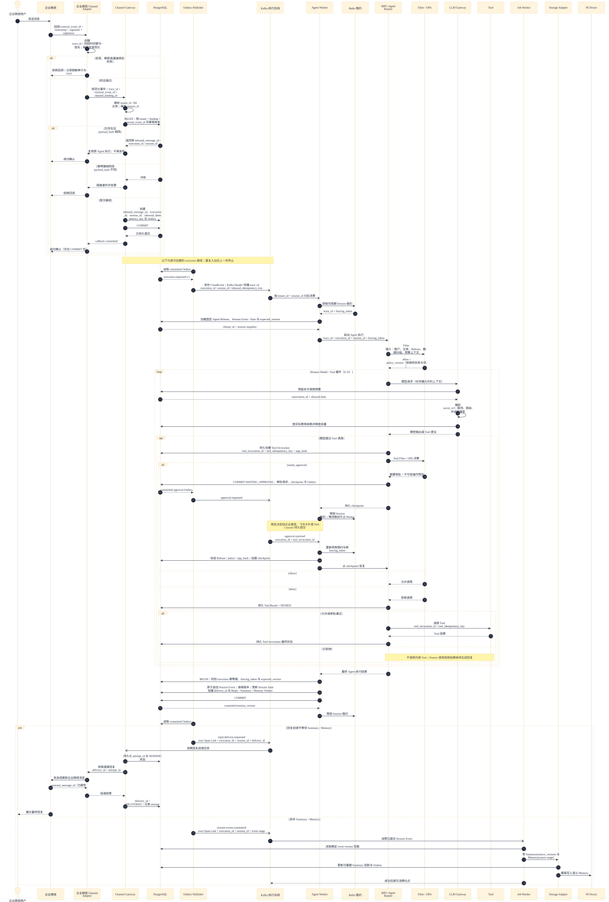
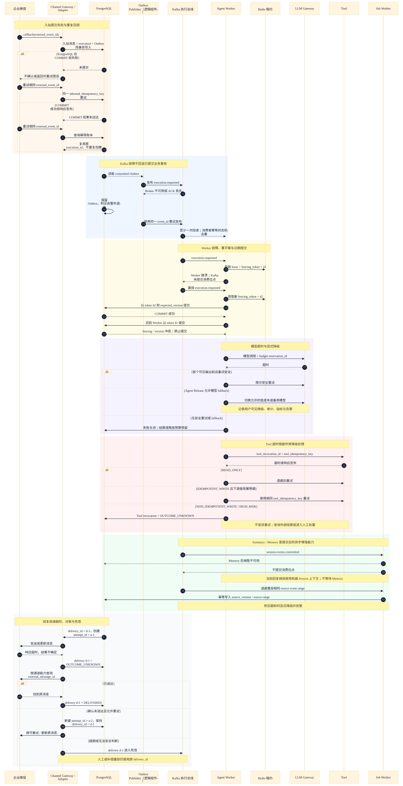

# 系统架构图与企业微信核心时序图

本文是 [GitHub Issue #3](https://github.com/douzhenyu/trpc-agent-service-douzhenyu/issues/3) 的可版本控制图表交付物。组件名称遵循仓库根目录的 [`CONTEXT.md`](../../CONTEXT.md)，系统边界来自[总体架构设计](architecture-design.md)、[已接受 ADR](../adr/README.md)与[绘图研究证据](../research/issue-3-architecture-diagrams-research.md)。`.mmd` 是权威图源，`.svg` 是便于 GitHub 和离线评审直接查看的渲染结果。

## 1. 系统架构图

[Mermaid 图源](diagrams/system-architecture.mmd) · [SVG 渲染结果](diagrams/system-architecture.svg)



图中只有 Admin API、Web Console、Agent Gateway、Channel Gateway、Agent Worker 和 Job Worker 是六类业务部署单元。Channel Adapter、Storage Adapter 和 Filter 分别是 Gateway 插件、Worker 进程内模块和 Runner 管线扩展点；LLM Gateway 按 [ADR-0022](../adr/0022-central-llm-gateway.md) 作为基础设施部署，不构成第七类业务服务边界。

Outbox Publisher 只表示“扫描已提交 Outbox 并发布”的逻辑组件；现有 ADR 尚未决定它是写入服务内后台任务、sidecar 还是共享 Relay，因此图中不把它归入任何新部署单元。

连线语义如下：

| 线型 | 语义 |
|---|---|
| 细实线箭头 | 同步调用、受控外部调用或进程内调用 |
| 粗实线箭头 | Kafka 上的异步命令或领域事件 |
| 虚线箭头 | 持久化、配置读取、租约、遥测、密钥解析或运行底座关系；具体语义由边标签限定 |

租户红色虚线框表示逻辑隔离范围，不表示每个租户复制一整套部署单元。共享后端依靠 `tenant_id`、复合外键、PostgreSQL RLS、消息分区/键、对象路径、向量过滤、预算和审计实现隔离；高敏租户可以通过存储配置档和专属 Worker Pool 加强物理隔离（[ADR-0004](../adr/0004-hybrid-tenant-data-isolation.md)、[ADR-0040](../adr/0040-tenant-composite-keys-and-rls.md)）。

## 2. 企业微信核心时序图

[Mermaid 图源](diagrams/wecom-core-sequence.mmd) · [SVG 渲染结果](diagrams/wecom-core-sequence.svg)



事务边界和异步边界是本图的关键：

1. Channel Gateway 只有在入站消息、唯一 Agent 执行和 Outbox 同一事务提交后才确认企业微信回调；重复事件复用原执行（[ADR-0017](../adr/0017-durable-inbound-idempotency-ledger.md)）。
2. Agent Worker 以 Kafka 分区、Session 租约、fencing token 和 `expected_version` 共同约束并发，过期 Worker 不得提交（[ADR-0010](../adr/0010-kafka-compatible-durable-execution-bus.md)、[ADR-0011](../adr/0011-stateless-workers-and-session-concurrency.md)）。
3. Session 提交原子追加不可变 Session Event、递增版本、更新可重建 Session State 并写 Outbox（[ADR-0012](../adr/0012-session-events-as-source-of-truth.md)）。
4. Summary、Memory 与回复投递消费已提交事件并行执行；当前回复不等待 Memory，异步链路用 Span Link 关联原 trace（[ADR-0013](../adr/0013-eventually-consistent-memory.md)、[ADR-0024](../adr/0024-opentelemetry-observability-stack.md)）。
5. Tool Invocation 先持久化再执行；审批等待释放 Worker，批准后重新取得租约并从 checkpoint 恢复（[ADR-0018](../adr/0018-tool-side-effect-and-approval-policy.md)、[ADR-0032](../adr/0032-tiered-tool-approval-and-resume.md)）。

## 3. 失败恢复补充时序图

[Mermaid 图源](diagrams/wecom-failure-recovery-sequence.mmd) · [SVG 渲染结果](diagrams/wecom-failure-recovery-sequence.svg)



补充图把主图中的恢复语义展开：PostgreSQL 提交前失败由企业微信重试；Kafka 故障由 committed Outbox 保留；Worker 重投由 fencing 和版本校验阻止迟到提交；模型只在安全条件下重试或按 Release 显式降级；非幂等 Tool 超时进入 `OUTCOME_UNKNOWN`；Memory 故障不阻塞当前回复；回复发送结果不确定时先对账，所有重试保持稳定 `delivery_id`（[ADR-0030](../adr/0030-fail-closed-critical-paths-and-explicit-degradation.md)、[ADR-0042](../adr/0042-at-least-once-im-delivery.md)）。

## 4. 标识创建与传播

以下名称是图表层面的逻辑关联标识；最终数据库列名和事件 Schema 由后续数据模型工单冻结。

| 标识 | 创建位置 | 主要传播范围 | 约束 |
|---|---|---|---|
| `trace_id` | Channel Adapter 接收回调时 | 内部调用、Kafka Header、Agent 执行；异步 Summary、Memory 和回复使用 Span Link | 外发模型前剥离内部 Baggage，不记录正文或原始 IM 身份 |
| `external_event_id` | 企业微信 | Channel Adapter、入站幂等账本 | 与租户和通道绑定共同形成入站去重范围 |
| `inbound_message_id` | Channel Gateway 入站事务 | Agent 执行、审计和查询 | 同一有效幂等键只对应一个入站消息 |
| `execution_id` | Channel Gateway 入站事务 | Outbox、Kafka、Agent Worker、Tool、审批、回复和异步 Job | 重复入站必须复用原 Agent 执行 |
| `session_id` | Channel Gateway 按通道身份规则确定 | Kafka 分区、Session 租约、Worker、Session Event、Summary 和 Memory | 始终与 `tenant_id`、`agent_app_id` 共同限定 |
| `tool_invocation_id` | Runner 持久创建 Tool Invocation 时 | Filter/OPA、审批、Tool、Tool Result Event 和审计 | 绑定工具版本、参数哈希、主体与结果状态 |
| `inbound_idempotency_key` | Channel Gateway | PostgreSQL 唯一约束与 execution 事件 | 来源为租户、通道绑定和稳定外部事件 ID |
| `tool_idempotency_key` | Tool Invocation 创建时 | Tool 执行器及支持幂等的下游 | 非幂等写不能因超时而盲目重试 |
| `delivery_id` | Session 最终提交事务 | Reply Outbox、Kafka、Channel Gateway、所有发送尝试与重放 | 一个逻辑回复稳定不变；每次尝试另建 `attempt_id` |

Kafka 事件使用版本化 CloudEvents JSON 信封携带租户、因果、关联、Trace、Schema 与数据分级元数据，不能把 Kafka 消息称为 Session Event（[ADR-0041](../adr/0041-versioned-cloudevents-json-contracts.md)）。

## 5. 渲染与 CI

CI 使用固定版本 `@mermaid-js/mermaid-cli@11.16.0` 渲染全部 `.mmd` 图源，并上传 SVG 构建产物。人工本地渲染可执行：

```powershell
npx --yes --package @mermaid-js/mermaid-cli@11.16.0 mmdc -i docs/architecture/diagrams/system-architecture.mmd -o docs/architecture/diagrams/system-architecture.svg --backgroundColor white
npx --yes --package @mermaid-js/mermaid-cli@11.16.0 mmdc -i docs/architecture/diagrams/wecom-core-sequence.mmd -o docs/architecture/diagrams/wecom-core-sequence.svg --backgroundColor white
npx --yes --package @mermaid-js/mermaid-cli@11.16.0 mmdc -i docs/architecture/diagrams/wecom-failure-recovery-sequence.mmd -o docs/architecture/diagrams/wecom-failure-recovery-sequence.svg --backgroundColor white
```
